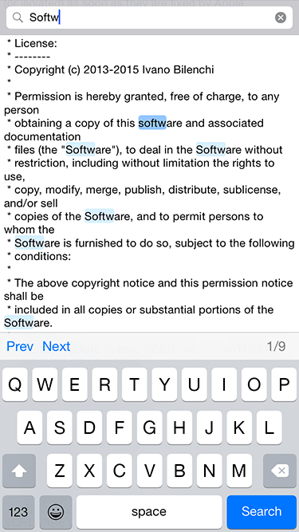

## ICTextView

#### Authors

- Ivano Bilenchi ([@SoftHardW](http://www.twitter.com/SoftHardW))

#### Description

`ICTextView` is a `UITextView` subclass with optimized support for string/regex search and highlighting.

It also features some iOS 7+ specific improvements and bugfixes to the standard `UITextView`.

#### Features

- Support for string and regex search and highlighting.
- Highly customizable.
- Doesn't use delegate methods (you can still implement your own).
- Methods to account for `contentInset` and `textContainerInset` in iOS 7+.
- Contains workarounds for many known iOS 7+ `UITextView` bugs.

#### Compatibility

**Supported iOS versions:** 4.x and above (match highlighting starting from iOS 5.x).

**Supported iOS SDKs:** 5.x and above.

#### Installation

`ICTextView` can be installed via [Cocoapods](http://cocoapods.org) (just add `pod 'ICTextView'` to your Podfile, then run `pod install`) or as a [Git submodule](http://git-scm.com/book/en/Git-Tools-Submodules).

Alternatively, you can clone this repo, or even just grab the [ICTextView](ICTextView) folder and put it somewhere in your project.

`ICTextView` requires the `QuartzCore` framework, so make sure to link against it in your build settings.

It is an ARC only project, meaning you must compile it with ARC enabled (either globally or specifically for every `ICTextView` .m source file).

`#import "ICTextView.h"` and you're ready to go.

#### Configuration

See comments in the `#pragma mark - Configuration` section of the [ICTextView.h](ICTextView/ICTextView.h) header file.

#### Usage

###### Search

Searches can be performed via the `scrollToMatch:` and `scrollToString:` methods. `scrollToMatch:` performs regex searches, while `scrollToString:` searches for string literals.

Both search methods are regex-powered, and therefore make use of `NSRegularExpressionOptions`. They both support animation, range restriction, custom end scroll positioning and forward/backward search direction.

If a match is found, `ICTextView` highlights a primary match, and starts highlighting other matches while the user scrolls. Searching for the same pattern multiple times automatically matches the next result.

The `rangeOfFoundString` property contains the range of the current search match. You can get the actual string by calling the `foundString` method.

The `resetSearch` method lets you restore the search variables to their starting values, effectively resetting the search. Calls to `resetSearch` cause the highlights to be deallocated, regardless of the `maxHighlightedMatches` variable.

After this method has been called, `ICTextView` stops highlighting results until a new search is performed.

###### Content insets methods

The `scrollRangeToVisible:consideringInsets:[...]` and `scrollRectToVisible:animated:consideringInsets:[...]` methods let you scroll until a certain range or rect is visible, eventually accounting for content insets.

This was the default behavior for `scrollRangeToVisible:` before iOS 7, but it has changed since (possibly because of a bug). These methods support animation and scroll positioning, similarly to the search methods.

The other methods are pretty much self-explanatory. See the `#pragma mark - Misc` section of the [ICTextView.h](ICTextView/ICTextView.h) header file for further info.

#### iOS 7 UITextView Bugfixes

Long story short, iOS 7 completely broke `UITextView`. `ICTextView` contains fixes for some very common issues:

- **NSTextContainer bug:** `UITextView` initialized via `initWithFrame:` had an erratic behavior due to an uninitialized or wrong `NSTextContainer`.
- **Caret bug:** the caret didn't consider `contentInset` nor `textContainerInset` and often went out of the visible area.
- **characterRangeAtPoint: bug:** `characterRangeAtPoint:` always returned `nil`.

These fixes, combined with the custom methods to account for `contentInset` and `textContainerInset`, should make working with `ICTextView` much more bearable
than working with the standard `UITextView`.

Bugfixes introduced by `ICTextView` will be removed (or isolated) as soon as they are fixed by Apple.

#### License

`ICTextView` is available under the MIT license. See the [LICENSE](LICENSE) file for more info.
